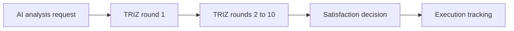

# 十轮 TRIZ 工作流

Feature Name: triz10-workflow
Updated: 2026-08-07

## Description

在根目录 FastAPI 服务的现有 AI 请求之下保存十轮 TRIZ 记录。每轮独立保留阶段职责、项目上下文、技术总结、方案、满意度和人工反馈。未指定问题的 `triz10` 请求使用“步进炉的水梁容易出现什么问题？如何避免？”作为缺省问题。

## Architecture

## Components and Interfaces

- `TrizAnalysisRound`: 关联 AI 请求的轮次记录。
- `POST /ai/analysis`: 创建 `triz10` 请求并生成第一轮。
- `POST /ai/analysis/{request_id}/triz-rounds/next`: 根据反馈创建下一轮。
- `POST /ai/analysis/{request_id}/triz-rounds/{round_no}/decision`: 保存满意度和反馈。
- `GET /ai/analysis/{request_id}/triz-rounds`: 返回全部轮次。

## Data Models

每条轮次记录包含请求标识、轮次编号、阶段名称、阶段职责、输入上下文、技术总结、方案、满意度、反馈和状态。`triz10` 请求创建时在输入中补充缺省问题，调用方提供 `input_payload_json.question` 时保留调用方问题。每个请求的轮次编号范围为 1 至 10，且保持唯一。

## Correctness Properties

- 一个 AI 请求的 TRIZ 轮次编号唯一。
- 系统仅创建编号 1 至 10 的轮次。
- 满意度与反馈只写入对应轮次。
- 所有前序轮次在创建后续轮次时保持可查询。

## Error Handling

- 请求不存在时返回 404。
- 请求类型不是 `triz10` 时返回 409。
- 第十轮后创建下一轮时返回 409。
- 轮次不属于请求时返回 404。

## Test Strategy

- 创建 `triz10` 请求后验证第一轮的检索范围和查险职责。
- 创建未提供问题的 `triz10` 请求后验证缺省问题已持久化。
- 创建后续轮次后验证第二至第五轮职责。
- 验证满意度保存、十轮上限和完整轮次查询。
